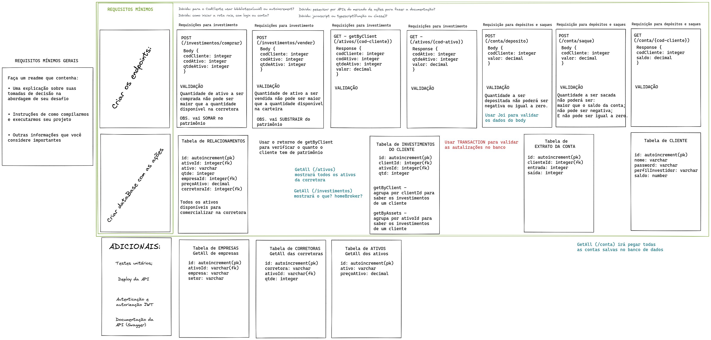

## Bem Vindo a este repositório

Abaixo contêm os desafios encontrados para realização do projeto, os motivos de certas escolhas, como você pode clonar o projeto, bem como as tecnologias que foram usadas.

## Contexto geral

Este projeto tem por objetivo simular as operações que são possíveis de serem realizadas por um cliente cadastrado numa corretora.

  

## Principais desafios encontrados
 - Montar as tabelas(1:N ou N:N), de forma que ficassem enxutas e tivessem um bom relacionamento;
 - Preparar o ambiente para os testes, pois era a primeira vez que fiz a instalação inicial em uma aplicação com testes;
 - Simular as funções com o framework Sinon, devido a dificuldade de interpretar os erros de tipagem que ocorriam nos testes;
 - Decisão de sair do framework Sinon/Mocha/Chai para o framework Jest.

## Porque das escolhas tomadas
 - Optei por criar as 'queries' sem usar ORM(Object-Relational Mapping) para treinar a lógica de como os relacionamentos acontecem dentro do mysql;
 - Escolhi typescript pois tem o benefício da tipagem dos retornos e assim acelera a identificação dos erros;
 - Escolhi usar autenticação por JsonWebToken, pois já conhecia as tipagens necessárias para os parâmetros e retornos;
 - Optei por iniciar os testes com Mocha/Chai/Sinon pois era o framework que da a opção de testas as chaves de um objeto, agrupando em uma linha de código;
 - Alterei a realização dos testes para usar o framework Jest, pois tive muita dificuldade para entender os erros retornados com o Sinon;

## Para executar o projeto
  1. Clone o repositório, com o comando abaixo, no terminal:

  - `git clone git@github.com:KerliS9/stock-market-api.git`

  2. Entre na pasta do repositório que você acabou de clonar:

  - `cd stock-market-api`

  3. Instale as dependências

  - `npm install`

  4. Em seu terminal digite

  - `npm run dev`

## Linguagens e ferramentas usadas

Para construção do projeto:
 - TypeScript;
 - Express;
 - Joi
 - JsonWebToken
 - EsLint
 - nodemon
 - mysql
 - dockerCompose
 - dotenv
 - http-status-codes

Para os testes unitários:
 - ts-jest
 - jest-express
