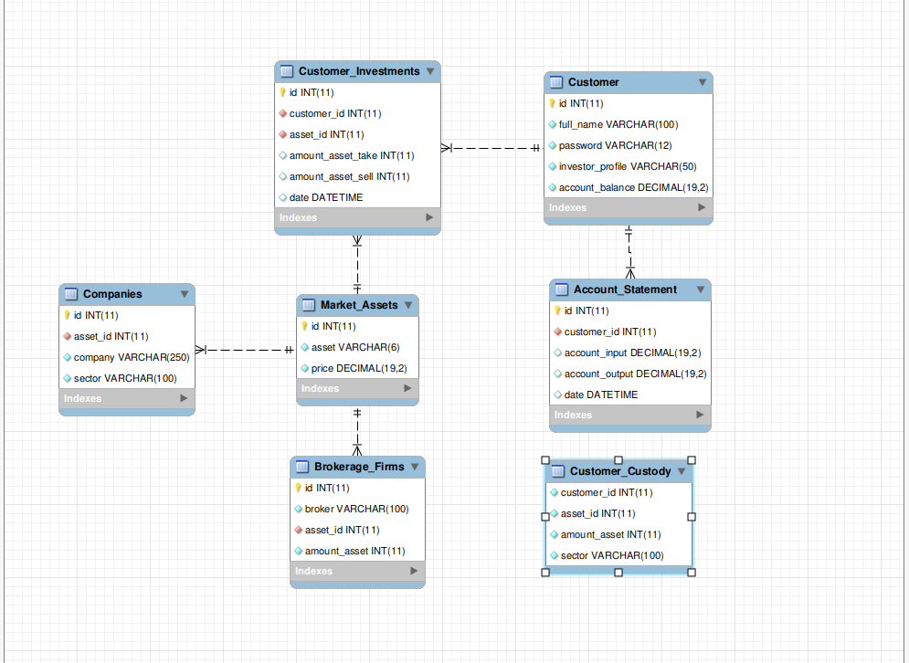
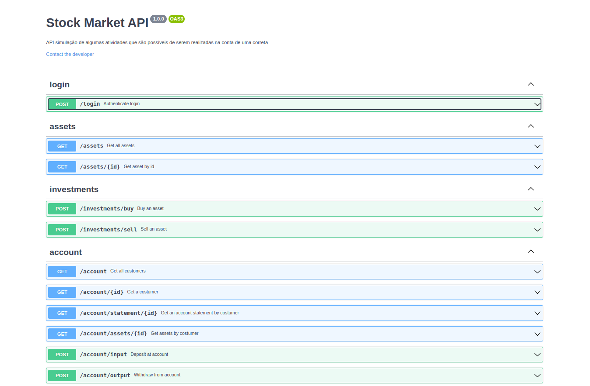
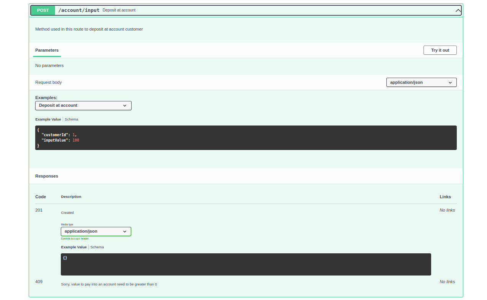

## Olá, bem vindo a este repositório :blush:

Abaixo relato os desafios encontrados para realização do projeto, os motivos de certas escolhas, como você pode clonar o projeto, bem como as tecnologias que foram usadas.


## Contexto geral

Este projeto tem por objetivo simular as operações que são possíveis de serem realizadas por um cliente cadastrado numa corretora.

<details>
  <summary><strong> :memo: Desenho inicial do projeto</strong></summary><br />
  <div style="display: inline_block">
    
  </div>
</details>

## Principais desafios encontrados :books:
 - Montar as tabelas(1:N ou N:N), de forma que ficassem enxutas e tivessem um bom relacionamento;
 - Preparar o ambiente para os testes, pois era a primeira vez que fiz a instalação inicial em uma aplicação com testes;
 - Simular as funções com o framework Sinon, devido a dificuldade de interpretar os erros de tipagem que ocorriam nos testes;
 - Decisão de parar de usar os frameworks Sinon/Mocha/Chai e passar a usar o framework Jest.

## Porque das escolhas tomadas :top:
 - Optei por criar as 'queries' sem usar ORM(Object-Relational Mapping) para treinar a lógica de como os relacionamentos acontecem dentro do mysql;
 - Escolhi typescript pois tem o benefício da tipagem dos retornos e assim acelera a identificação dos erros;
 - Escolhi usar autenticação por JsonWebToken, pois já conhecia as tipagens necessárias para os parâmetros e retornos;
 - Optei por iniciar os testes com Mocha/Chai/Sinon pois era o framework que da a opção de testar as chaves de um objeto em uma linha de código;
 - Alterei a realização dos testes para usar o framework Jest, pois tive muita dificuldade para entender os erros retornados com o Sinon;


<details>
  <summary><strong>👨‍💻 Para executar o projeto</strong></summary><br />

  > ✨ **Dica:** Para um melhor aproveitamento é recomendável ter as ferramentas abaixo instaladas na sua máquina <br />
  > - Editor para trabalhar com o código como [VSCode](https://code.visualstudio.com/)<br />
  > - [Docker]((https://www.docker.com/)) para executar o projeto por container <br />
  > - Ferramenta visual para interagir com o banco de dados, como o [Workbench](https://dev.mysql.com/downloads/workbench/) <br />
  > - Ferramenta de API REST, como [Insomnia](https://insomnia.rest/download)

  1. Clone o repositório, com o comando abaixo, no terminal:

  - `git clone git@github.com:KerliS9/stock-market-api.git`

  2. Entre na pasta do repositório que você acabou de clonar:

  - `cd stock-market-api`

  3. Instale as dependências

  - `npm install`

  4. Configure as variáveis de ambiente no arquivo .env, conforme o exemplo informado no arquivo example.env

  5. Se tiver o docker instalado e configurado na máquina: digite no terminal o comando abaixo <br />
  Caso contrário, vá para o passo 'Rodando sem o docker' e depois retorne ao passo 5 <br />
  ⚠ Atenção ⚠ Se atente para as portas que você está configurando no .env e/ou a porta padrão usada pelo mysql(3306) <br />

  - `docker-compose up -d`

  6. Copie o arquivo script 'StockMarketDB.sql' da pasta stock-market-api e cole na sua ferramenta visual de preferência, exemplo Mysql Workbench

  7. Execute o script no Workbench

  8. Volte ao seu terminal e digite

  - `npm run dev`

  9. Acesse a sua ferramenta de API REST preferida, exemplo insomnia e simule o uso das rotas conforme o arquivo .src/routes/ <br />
   ⚠ Atenção ⚠  Todas as rotas que solicitem informação específica de um cliente possuem validação por token.

  10. Para rodar os testes unitários

  - `npm run test`

  11. Para verificar a cobertura dos testes

  - `npm run test:cov`

  <details>
    <summary>Rodando sem uso do Docker</summary><br />

    - Passos 1 á 3, segue da mesma forma

    Em substituição ao passo 5, será obrigatória a instalação dos pacotes Node v16 e MySql

  </details>
</details>

<details>
  <summary><strong>🏦 Tabelas do banco</strong></summary><br />
  <div style="display: inline_block">
    
  </div>

  O banco tem 7 tabelas - direcionadas a 3 entidades.
  <details>
    <summary><strong>Entidade Cliente</strong></summary><br />

    ```sql
    CREATE TABLE StockMarketDB.Customer (
      id int AUTO_INCREMENT NOT NULL,
      full_name varchar(100) NOT NULL,
      password varchar(12) NOT NULL,
      investor_profile varchar(50) NOT NULL,
      account_balance decimal(19, 2) NOT NULL,
      PRIMARY KEY (id) 
    )ENGINE=InnoDB;

    CREATE TABLE StockMarketDB.Account_Statement (
      id int AUTO_INCREMENT NOT NULL,
      customer_id int NOT NULL,
      account_input decimal(19, 2),
      account_output decimal(19, 2),
      date DATETIME DEFAULT CURRENT_TIMESTAMP,
      PRIMARY KEY (id),
      FOREIGN KEY (customer_id) REFERENCES StockMarketDB.Customer (id) ON DELETE CASCADE
    )ENGINE=InnoDB;

    CREATE TABLE StockMarketDB.Customer_Custody (
      customer_id int NOT NULL,
      asset_id int NOT NULL,
      amount_asset int NOT NULL,
      sector varchar(100) NOT NULL
    )ENGINE=InnoDB;
    ```
  </details>

  <details>
    <summary><strong>Entidade Ativos</strong></summary><br />

    ```sql
    CREATE TABLE StockMarketDB.Market_Assets (
      id int AUTO_INCREMENT NOT NULL,
      asset varchar(6) NOT NULL,
      price decimal(19, 2) NOT NULL,
      PRIMARY KEY (id)
    )ENGINE=InnoDB;

    CREATE TABLE StockMarketDB.Brokerage_Firms (
      id int AUTO_INCREMENT NOT NULL,
      broker varchar(100) NOT NULL,
      asset_id int NOT NULL,
      amount_asset int NOT NULL,
      PRIMARY KEY (id),
      FOREIGN KEY (asset_id) REFERENCES StockMarketDB.Market_Assets (id) ON DELETE CASCADE
    )ENGINE=InnoDB;

    CREATE TABLE StockMarketDB.Companies (
      id int AUTO_INCREMENT NOT NULL,
      asset_id int NOT NULL,
      company varchar(250) NOT NULL,
      sector varchar(100) NOT NULL,
      PRIMARY KEY (id),
      FOREIGN KEY (asset_id) REFERENCES StockMarketDB.Market_Assets (id) ON DELETE CASCADE
    )ENGINE=InnoDB;
    ```
  </details>

  <details>
    <summary><strong>Entidade Investimentos</strong></summary><br />

    ```sql
    CREATE TABLE StockMarketDB.Customer_Investments (
      id int AUTO_INCREMENT NOT NULL,
      customer_id int NOT NULL,
      asset_id int NOT NULL,
      amount_asset_take int,
      amount_asset_sell int,
      date DATETIME DEFAULT CURRENT_TIMESTAMP, 
      PRIMARY KEY (id),
      FOREIGN KEY (customer_id) REFERENCES StockMarketDB.Customer (id) ON DELETE CASCADE,
      FOREIGN KEY (asset_id) REFERENCES StockMarketDB.Market_Assets (id) ON DELETE CASCADE
    )ENGINE=InnoDB;
    ```
  </details>

</details>

<details>
  <summary><strong>🛠 Linguagens e ferramentas usadas</strong></summary>

  ### Para construção do projeto:
  - [TypeScript](https://www.typescriptlang.org/)
  - [Node.js](https://nodejs.org/en/)
  - [Express](http://expressjs.com/)
  - [Joi](https://www.npmjs.com/package/joi)
  - [JWT](https://jwt.io/)
  - [EsLint](https://eslint.org/)
  - [nodemon](https://www.npmjs.com/package/nodemon)
  - [mysql](https://www.mysql.com/)
  - [docker](https://www.docker.com/)
  - [dotenv](https://www.npmjs.com/package/dotenv)
  - [http-status-codes](https://www.npmjs.com/package/http-status-codes)

  ### Para os testes unitários:
  - [ts-jest](https://www.npmjs.com/package/ts-jest)
  - [jest-mock/express](https://www.npmjs.com/package/@jest-mock/express)

  ### Para documentação
  - [swaggerUi](https://swagger.io/tools/swagger-ui/)

</details>

### Documentação

Disponível na pasta ./src/documentation <br />
Separada por subpastas, conforme a rota.

  <div style="display: inline_block">
    
  </div>

<details>
  <summary><strong> Exemplo: por dentro da rota</strong></summary><br />
  <div style="display: inline_block">
    
  </div>
</details>


Projeto desenvolvido por Kerli Schroeder :hugs:
